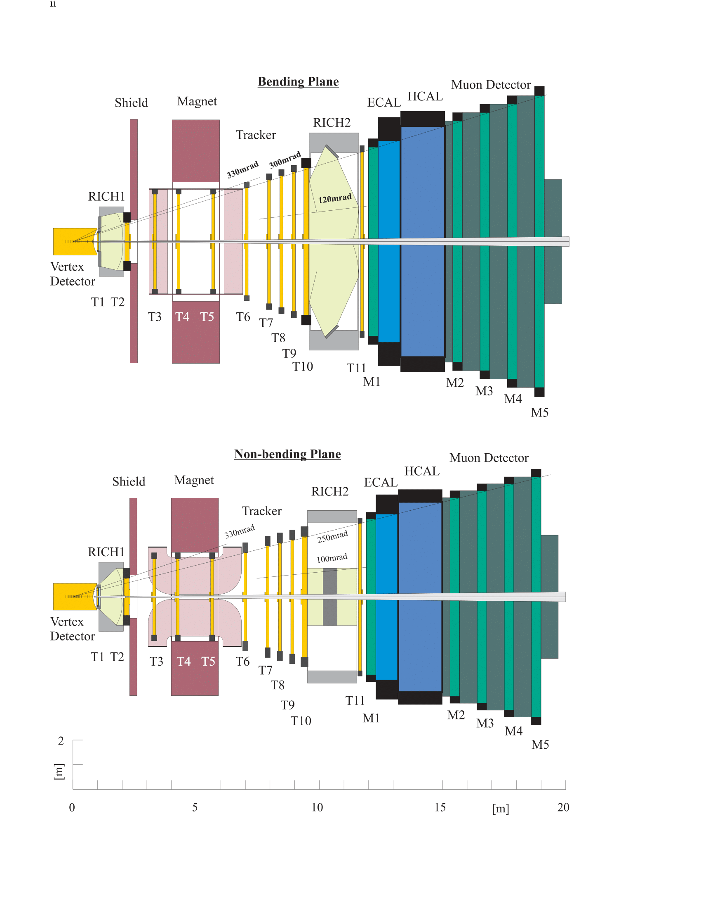
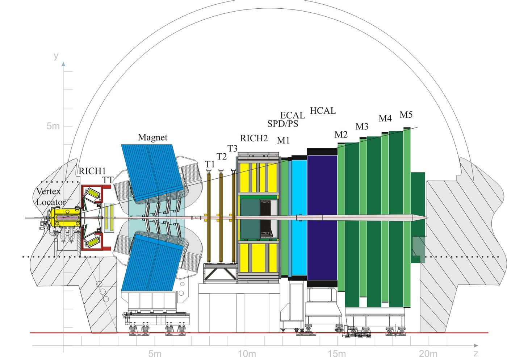

# The LHCb Experiment

<!-- START doctoc generated TOC please keep comment here to allow auto update -->
<!-- DON'T EDIT THIS SECTION, INSTEAD RE-RUN doctoc TO UPDATE -->
**Table of Contents**  *generated with [DocToc](https://github.com/thlorenz/doctoc)*

- [The LHCb Experiment](#the-lhcb-experiment)
  - [The detector](#the-detector)
    - [Introduction](#introduction)
    - [General layout](#general-layout)
    - [Magnet](#magnet)
    - [Vertex detector system](#vertex-detector-system)
- [Questions](#questions)

<!-- END doctoc generated TOC please keep comment here to allow auto update -->

<!--  -->

## The detector
### Introduction

- Single-arm spectrometer.
- Forward angular coverage of $10\text{mrad}$ to $300(250)\text{mrad}$ in the bending(non-bending) plane.
- The geometry of the detector is chosen based on the fact that at high energies the $b$- and $\bar{b}$-hadrons are mostly produced in the same forward cone.
- Decrease of acceptance for high momentum due to the loss of particles below $10\text{mrad}$.
- Decrease of acceptance for low momentum deu to slow pions that do not hit enough tracking stations.

### General layout

- We define a right-handed coordinate system centered at the interaction point with $z$ along the beam axis and $y$ pointing upwards.
- All detector subsystems are assembled in two halves, except the vertex detector.

### Magnet

- Dipole magnet, close to the interaction region to keep its size small
- The RICH1 covers momentum down to $1\text{GeV/c}$ and is required to be in a region of low magnetic field.
- Superconducting magnet to obtain high field integral $4\text{Tm}$ 
- The magnetic field is oriented vertically with a maximum value of $1.1\text{T}$
- The polarity of the field can be flipped in order to reduce systematic errors in $CP$ violation measurements that could arise from the left-right asymmetry of the detector.
- The free aperture is $4.3\text{m}$ horizontally and $3.6\text{m}$ vertically.

### Vertex detector system

- Consists of 17 stations each containing two discs of silicon detectors perpendicular to the beam.
- Signal to noise ratio of 8

# Questions

- Q: Don't we lose half the data if the $b$- and $\bar{b}$-hadrons are produced at 0 and $\pi\text{rad}$?
- - A: Yes.