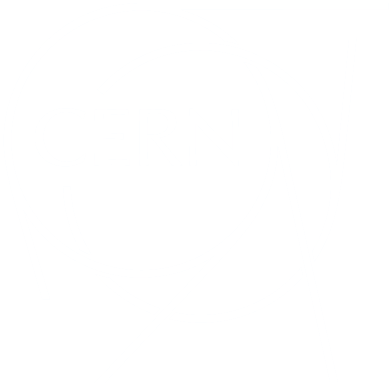

# CERN Summer Student Programme 2023

## LHCb Collaboration

### Supervisors: Dr. Federico Betti & Prof. Angelo Carbone

Study of a new kinematic weighting algorithm for the measurement of CP asymmetries in charm decays.

## Requirements
- [ROOT](https://github.com/root-project/root): The ROOT framework is required for this project.
- [Python](https://www.python.org): Python programming language is required for this project.

Please make sure you have both ROOT and Python installed before proceeding with the project.
